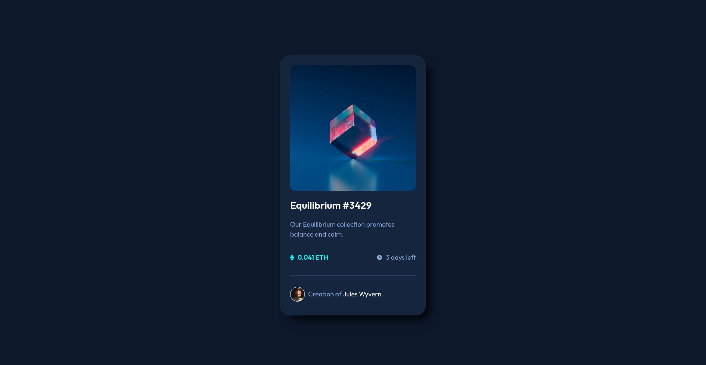

# Frontend Mentor - Nft Preview Card solution

This is a solution to the Nft Preview Card challenge on [Frontend Mentor](https://www.frontendmentor.io/).

## Table of contents

- [Overview](#overview)
	- [Screenshot](#screenshot)
	- [Links](#links)
- [My process](#my-process)
	- [What I learned](#what-i-learned)
	- [Questions to community](#questions-to-community)
	- [Edits after feedback](edits-after-feedback)
- [Author](#author)

## Overview

### Screenshot

### Links

- Solution URL: [GitHub - OignonFugace/FEM__nft-preview-card-component](https://github.com/OignonFugace/FEM__nft-preview-card-component)
- Live Site URL: [Frontend Mentor | NFT preview card component](https://oignonfugace.github.io/FEM__nft-preview-card-component/)

## My process

### What I learned
- Adding the hover effect on the image (background + icon triggering on hover).
- Animating css with `transition`.
- Styling `
` elements. 

### Questions to community
Hi everyone, 

I am pretty satisfied with the outcome, but unsure whether I have used proper or common approches on these three subjects :
- Styling `
` elements : the problem being that mine without the `opacity: 30%` seems too wide (in comparison to the design expectations) even after reducing its height to the minimum of 1px. So I am wondering is there exists some sort of a css one liner that would render a thin line (thinner than 1px ?) without having to use all those `border` and `opacity` properties. 
- Adding the hover effect on the image (background + icon triggering on hover).
- The circle around the avatar.

Any feedback on those or any other part of the challenge is welcome !

Thank you all. 

### Edits after feedback
- Add `<h1 class="sr-only">` that is visually hide the title but make sure it is present for screen readers. 
- Add `aria-hidden="true"` and `focusable="false"` on each svgs icon that are decorative only to make all assistive technologies such as screen readers ignore those svgs.  
- Modify the alternative text of the avatar to something more explicit and descriptive than `avatar`.
- Remove `
`, instead using `border-top` to the avatar's part. 
- Use unitless line-height values instead of `rem` as advised here : [line-height - CSS: Cascading Style Sheets | MDN](https://developer.mozilla.org/en-US/docs/Web/CSS/line-height#prefer_unitless_numbers_for_line-height_values)
- Placing the `font-size` property on `html` element rather than `body`, using `rem` (but really they are percentage of the root font given by the browser) to ensure that the end user can decide of the font size he wants in his browser, but respecting the 18px required in `style-guide.md`.
- Swich from image overlay div in HTML to ::before pseudo-element in CSS. 

## Author

- Website - [Oignon Fugace - par Tanguy Freycon](https://oignonfugace.com/)
- Frontend Mentor - [@OignonFugace](https://www.frontendmentor.io/profile/OignonFugace)

